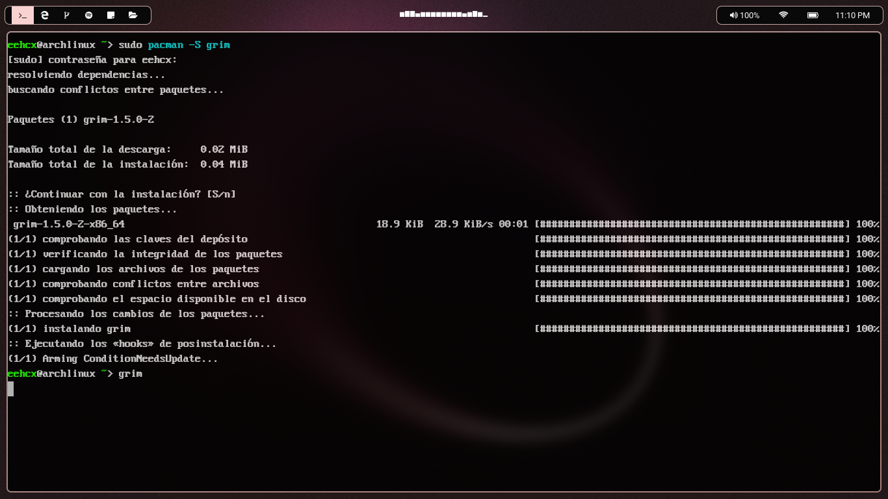

# eehcx dotfiles

There are _my_ humble dotfiles configuration, suggestions are welcome.

### What's Included

My personal workflow and configuration, that's includes there tools:

- **gvim:** _Syntax highlight_ and _language support_ for web based development, same includes a lot of `plugins` for my personal choise.

Also _I use hyprland btw_ so there are my **setup**:

#### **Hyprland:**

- **Main keybinds** (Super as modifier):
  - `Super + Q`: Terminal (foot)
  - `Super + D`: Application menu (Wofi)
  - `Super + E`: File manager (Nemo)
  - `Super + S`: Interactive screenshot
  - `Super + .`: Emoji selector (emote)
- **Window and workspace navigation**
- **Multimedia and brightness controls**
- **Smooth animations** with blur and transparency effects
- **Custom window rules** for opacity in specific apps (VS Code, Obsidian, Spotify, etc.)
- **Multiple layout support** (dwindle and master)
- **Gaming support** (controlled tearing, AMD optimizations)

#### **Waybar:**

- **Interactive workspaces** with pink highlights (#f8d2d1)

- **Essential modules:**
  - CPU, memory and storage
  - Volume and brightness with hover controls
  - Network and battery with warning states
  - Custom clock

- **Visual design:**
  - Semi-transparent dark background (#090909)
  - Hover effects with pastel pink colors
  - Rounded corners and adjusted padding

#### **Wofi:**

- **Dark theme** with pink accents (#f8d2d1)
- **Vertical layout** 800x300 pixels
- **Real-time search** with icons
- **Visual states:**
  - Input with gray border (#171717)
  - Selected items with pink background and dark text
  - Optimized padding for readability

## Preview



*[Wallpaper source: Raycast Wallpapers](https://www.raycast.com/wallpapers)*

## Installation

**⚠️ Warning**: Before using these dotfiles, please:
- Fork this repository
- Review the code thoroughly
- Remove any components you don't need

Don't use my settings blindly unless you understand the implications. **Use at your own risk!**

### Quick Installation

```shell
git clone https://github.com/eehcx/dotfiles.git
cd dotfiles
./install.sh
```

> **💡 INFO**: _Installation with Arch + Debian/Ubuntu support_